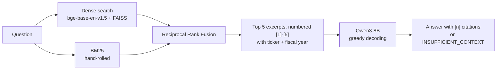

# SEC 10-K RAG — cited answers from Big Tech annual reports

A hand-built retrieval-augmented generation (RAG) system over the 10-K filings of
**Apple, Microsoft, NVIDIA, Alphabet and Amazon** (3 fiscal years each, 15 filings).
Ask a question; get a 2–4 sentence answer where **every fact cites a numbered excerpt**
from the filings — or an explicit refusal when the excerpts don't contain the answer.

**[▶ Try the live demo](https://huggingface.co/spaces/modelling-giant/sec-10k-rag)** ·
[Notebook with all outputs](notebooks/RAG-system-project.ipynb) ·
[Results CSV](results/results_validation.csv)

Every component (chunking, filtering, BM25, fusion, MMR, prompting) is written by hand
so each design choice is visible and measured, rather than hidden behind a framework.

---

## How it works



| Stage | What it does | Why |
|---|---|---|
| **Corpus** | 15 filings pinned by SEC accession number ([`data/manifest_pinned.json`](data/manifest_pinned.json)) | "Newest 3 filings" changes each year; pinning keeps chunk IDs (and the eval set) valid forever |
| **Chunking** | 1,100 characters, 200 overlap → 6,049 chunks | Measured: 0% of chunks exceed the embedder's 512-token limit (median 177, p95 281) |
| **Filtering** | Drop chunks < 200 chars, XBRL tag soup, number-only tables, signature pages, exhibit indexes, tables of contents → **5,089 chunks** | Junk can't answer a question but can still be retrieved and push a real chunk out of the top-k |
| **Stable IDs** | `AAPL_2024__0148` assigned once, *before* content filters | Editing a filter never renumbers chunks, so saved gold labels stay correct |
| **Dense search** | `bge-base-en-v1.5`, query prefix, unit-length vectors, exact FAISS search | Finds paraphrases ("purpose-built silicon" ≈ "TPU") |
| **BM25** | Hand-written with an inverted index | Finds exact names, numbers and legal terms that embeddings blur |
| **RRF fusion** | Combines the two ranked lists by *position*, k = 60 | BM25 scores and cosine similarities live on different scales; ranks don't |
| **Generation** | Qwen3-8B, numbered excerpts, 4 prompt rules, greedy decoding | Citations you can check; a fixed refusal string detectable in code; same question → same answer |

## Results

Retrieval ablation on 10 hand-written questions, each with one gold chunk.
Every row runs through the **same** `search()` function with different flags, so two
rows differ only in the component being tested.

| Configuration | hit@1 | hit@3 | hit@5 | hit@10 | MRR | p50 | p95 |
|---|---|---|---|---|---|---|---|
| 1 · dense only | 0.30 | 0.50 | 0.80 | 0.80 | 0.470 | 14 ms | 16 ms |
| **2 · dense + BM25 (RRF) — selected** | **0.50** | **0.90** | **0.90** | **1.00** | **0.694** | 24 ms | 30 ms |
| 3 · + MMR (λ = 0.95) | 0.50 | 0.90 | 0.90 | 1.00 | 0.694 | 26 ms | 31 ms |
| 4 · + cross-encoder rerank | 0.50 | 0.70 | 0.70 | 0.90 | 0.617 | 114 ms | 157 ms |
| 5 · + MMR + rerank | 0.50 | 0.70 | 0.70 | 0.90 | 0.617 | 116 ms | 152 ms |

*hit@k* = share of questions whose gold chunk is in the top k.
*MRR* = average of 1/rank of the gold chunk (rank 1 → 1.0, rank 2 → 0.5, missed → 0).
Latency measured on a Kaggle GPU.

### What the numbers say

1. **BM25 is the biggest single win.** Dense-only missed 2 of 10 questions entirely
   (Alphabet's custom AI chips; NVIDIA's headquarters). Adding BM25 found both and
   raised MRR from 0.47 to 0.69 for +10 ms.
2. **MMR does nothing on this corpus — so it was dropped.** Average similarity among the
   top-5 results was 0.790 with and without MMR. Lower λ only hurt recall
   (the λ sweep degrades monotonically, as a correct implementation should).
3. **The off-the-shelf reranker made results worse** (MRR 0.694 → 0.617, ~4–5× latency).
   `ms-marco-MiniLM` is trained on web search queries, not long financial questions.
   Because the gold chunk is in the top 50 candidates for **10/10** questions, every
   remaining miss is a *ranking* problem, not a *finding* problem — which makes
   fine-tuning the reranker on this domain the measured next step.

### Example output (from the notebook)

> **Q:** How large was the buyback authorization Apple's board approved in spring 2024,
> how much had been drawn down by fiscal year end, and what became of the remaining
> capacity under the prior year's program?
>
> **A:** Apple's board approved a $110 billion buyback authorization in spring 2024 [4].
> By fiscal year end, $20.9 billion had been drawn down [1]. The remaining capacity under
> the prior year's program was utilized in the fourth quarter of 2024, with the final
> $4.1 billion being used [1].

> **Q:** What will Apple's share price be at the end of next year?
>
> **A:** `INSUFFICIENT_CONTEXT`

The answers are model output: the citations exist precisely so a reader can check each
figure against the filing.

## Limitations (honest list)

- **Small eval set.** 10 questions is enough to spot large effects, not to rank close
  configurations. Scaling to ~100 questions is the first next step.
- **Retrieval is measured; generation is not yet.** No automatic score for answer
  correctness or citation accuracy.
- **One question at a time.** Follow-ups like "and Microsoft?" are not understood.
- **Fiscal years differ by company** (e.g. NVIDIA's FY2026 ends January 2026; Microsoft's
  ends June). Questions about "2025" can mix periods.
- **Demo vs notebook precision.** The notebook runs Qwen3-8B in 4-bit (fits a 16 GB
  Kaggle GPU); the demo runs it in bf16. Retrieval is identical; wording can differ slightly.

## Repository layout

```
sec-10k-rag/
├── app.py                    # public Gradio demo (Hugging Face Space, ZeroGPU)
├── rag/                      # the pipeline as a small package
│   ├── config.py             #   every tunable number in one place
│   ├── edgar.py              #   download pinned filings, HTML -> text
│   ├── chunking.py           #   split, freeze IDs, filter junk
│   ├── store.py              #   save/load artifacts (JSON + NumPy, no pickle)
│   ├── retrieval.py          #   BM25, RRF, MMR, reranker, one search() for all rows
│   ├── generation.py         #   prompt, context building, Qwen generator
│   └── evaluation.py         #   hit@k, MRR
├── scripts/
│   ├── build_index.py        # rebuild artifacts/ from EDGAR
│   ├── evaluate.py           # reproduce the results table
│   └── deploy_space.py       # publish the demo to Hugging Face
├── artifacts/                # chunks.jsonl + embeddings.npy (the index, ~22 MB)
├── data/                     # pinned filing list, eval questions
├── results/                  # results_validation.csv
├── notebooks/                # the original experiment, with outputs
├── space/                    # README + requirements used only by the Space
└── docs/DEPLOY.md            # step-by-step: GitHub + live demo
```

## Run it yourself

```bash
git clone https://github.com/TuAnh-Vo/sec-10k-rag.git
cd sec-10k-rag
pip install -r requirements.txt

python scripts/evaluate.py          # reproduce the table (uses the shipped artifacts/)
python app.py                       # local demo; needs a GPU with ~17 GB for Qwen3-8B
GENERATOR=Qwen/Qwen3-1.7B python app.py   # smaller model for weaker machines
```

To rebuild the index from the raw filings:

```bash
export SEC_USER_AGENT="Your Name your.email@example.com"   # SEC requires contact details
python scripts/build_index.py
```

**Reproducibility note:** chunk IDs depend on the exact text extraction and splitting.
The filings are pinned and their character lengths are checked on load; the expected
result is 5,089 chunks. Different versions of BeautifulSoup or `langchain-text-splitters`
can shift boundaries — the scripts warn instead of failing silently.

## Next steps

- Grow the eval set to ~100 questions; add FinanceBench as a held-out test set
- Fine-tune the cross-encoder on hard negatives mined from the hybrid retriever
- Measure generation: answer correctness, citation accuracy, correct vs false refusals
- Metadata-scoped search (company / fiscal year) for comparison questions

## Built with

`bge-base-en-v1.5` · FAISS · hand-written BM25 · Qwen3-8B · Hugging Face Transformers ·
sentence-transformers · Gradio · SEC EDGAR

## License

Code: MIT. The filings are public documents published by the companies on SEC EDGAR.
This project is for learning and research; it is not investment advice.
